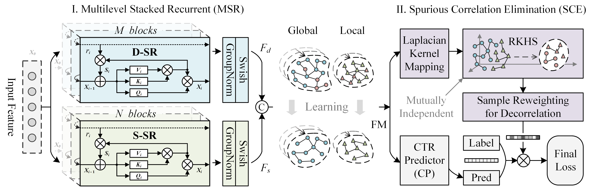

# RE-SORT

This is an official implementation of ***RE-SORT*** for CTR prediction task, as described in our paper:

Songli Wu, Liang Du, Jia-Qi Yang, Yuai Wang, De-Chuan Zhan, Shuang Zhao and Zixun Sun.
[RE-SORT: Removing Spurious Correlation in Multilevel Interaction for CTR Prediction](https://arxiv.org/pdf/2309.14891.pdf). arXiv preprint arXiv:2309.14891, 2024.



## Introduction

RE-SORT: A CTR prediction framework that removes spurious correlations in multilevel feature interactions, which leverages critical causal relationships between items and users in diverse nonlinear feature spaces to enhance the CTR prediction.

## Dependencies

RE-SORT has the following dependencies:

+ python 3.6+
+ pytorch 1.10+ 

## Quick Start

python run_expid.py --config {config_dir} --expid {experiment_id} --gpu {gpu_device_id}


## 🔥 Citation
If you find our RE-SORT helpful for your research, please consider citing the following paper:
```
@article{songli2024resort,
  Title={RE-SORT: Removing Spurious Correlation in Multilevel Interaction for CTR Prediction},
  Author={Songli, Wu and Liang, Du and Jia-Qi, Yang and Yuai, Wang and De-Chuan, Zhan and Shuang, Zhao and Zixun, Sun},
  journal={arXiv preprint arXiv:2309.14891},
  year={2024}
}
```
